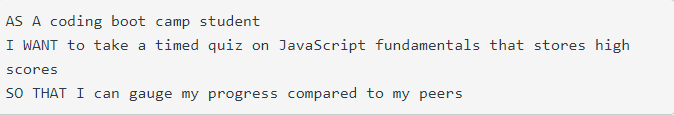
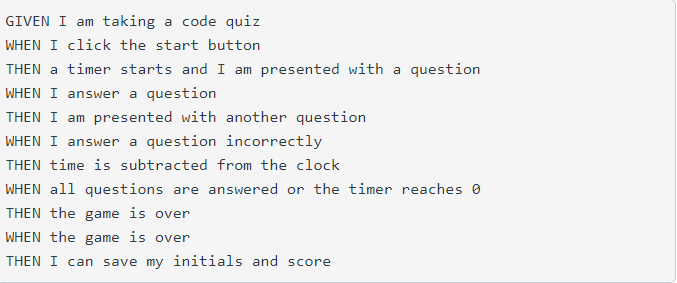
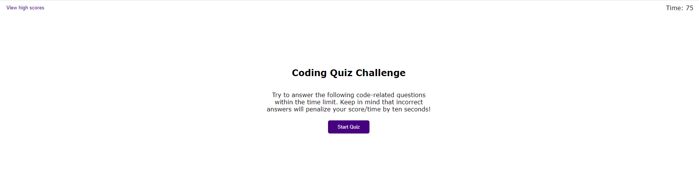
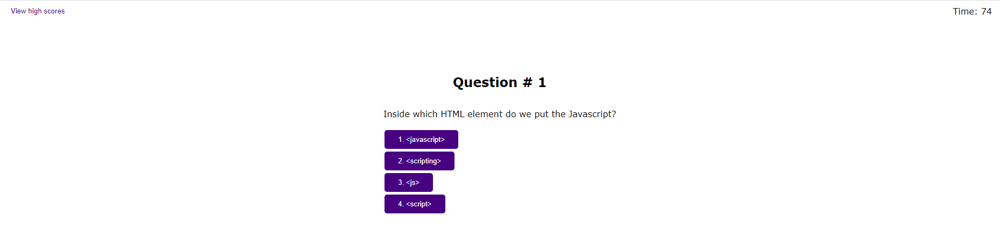
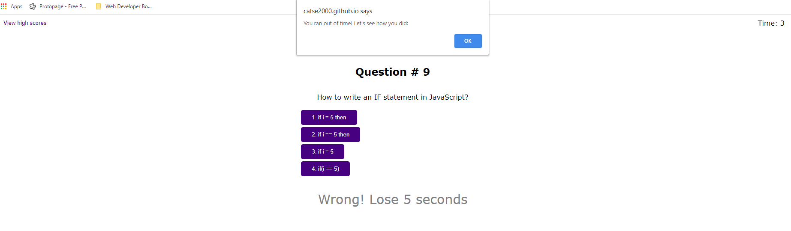
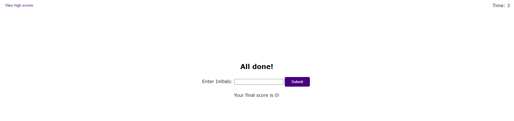
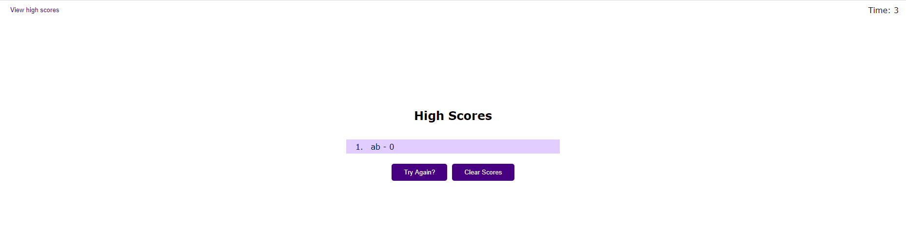

# Challenge Assessment ReadMe

## User Story

## Acceptance Criteria

## Work done

### index.html
* Created HTML file
* Created Divs to house elements as they are created

### style.css
* started by adding all elements I planned to create into index.html to style
* styled similar to the example provided for the challenge. Used similar colors
* created variables to house three primary colors used through site
* used flex to style for responsive design and mobile accessability
* added comments to show what each section of styling was for

### script.js
* added global variables to handle the common element creation such as h1, p, and start button
* created a loadMenu() to be called anytime the Start Menu needed to be shown
* created functions that would react for every "click" action, such as:
    * clearMenu(): to clear off start menu and set the stage for questions
    * setQuestions(): to update h1 and p elements, and add response buttons
    * countDown(): to start the timer and handle error handling for timer
    * checkAnswer(): to confirm if answer is correct (add to score variable) or incorrect (deduct time from timer)
    * endGame(): to handle what the application does when the quiz is over
    * storeHighScore(): to store the most recent score in localStorage (using an array to push various values in case the quiz is retried)
    * showHighScore(): to pull data from local storage and show it to the user
    * clearScores(): to clear scores out of local storage
    * clearChangeContainer(): to house instructions to clear out the div that was primarily being used to populate new elements and style them
* Once program was running, went through and addressed errorhandling, and cleared out unnecessary elements

## Links to completed work
* [Github Repository](https://github.com/catse2000/challenge-assessment)
* [Working Application](https://catse2000.github.io/challenge-assessment/)

## Screenshots of completed Challenge
### Start Menu

### Quiz

### Quiz End

### Enter Initials for High Score

### Show High Scores

